# Dronelab : des agents IA conçoivent seuls un drone de levage lourd

**NVIDIA Paris Claw Agent Challenge 2026** · construit sur [Hermes Agent](https://github.com/NousResearch/hermes-agent) · simulation sur RTX 5090

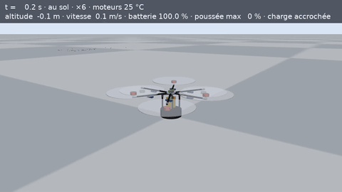

> L'agent part d'un catalogue de pièces vide et conçoit un drone de levage lourd pour le [DARPA Lift Challenge](https://www.darpa.mil/research/challenges/lift) : aéronef de moins de 55 lb, charge d'au moins 110 lb, 5 milles nautiques.
>
> - Il choisit de vraies pièces sur les fiches des fabricants.
> - Il dessine en CAO ses propres pièces en aluminium et les calcule par éléments finis.
> - Il fait voler le résultat dans une simulation physique.
>
> Il travaille des heures d'affilée, sans qu'un humain touche à la conception. Un second modèle audite chaque affirmation, et un éclaireur ramène de YouTube et des forums les pannes du monde réel. Toute la course se suit en direct sur Discord.

📂 **Pour voir tout le travail de l'agent, ouvrez [`course/`](course/)** : cahier de labo cycle par cycle, audits, notes de terrain, catalogue de pièces, scripts CAO et fichiers STEP des pièces, résultats de chaque vol. C'est un extrait nettoyé de la course : le dossier de travail complet (`runs/`) est exclu de Git par `.gitignore`, car il contient de gros fichiers (vidéos de vol, maillages 3D, télémétrie complète, journaux bruts, plus de 1 Go).

## Pourquoi ce projet

Le DARPA Lift Challenge m'a passionné : faire porter à un drone de moins de 25 kg une charge d'environ 50 kg, sur 9 km. Mais je n'ai jamais construit de drone moi-même. D'où l'idée : confier ce problème à un agent et voir jusqu'où il peut aller en vraie ingénierie, c'est-à-dire avec de la 3D, du calcul et des essais, et pas seulement du texte.

## J'ai construit le harnais, les agents ont fait l'ingénierie

| Ce que j'ai fait | Ce que les agents ont fait, seuls |
| --- | --- |
| Configurer quatre profils Hermes et leur personnalité | Chercher les pièces et les choisir sur les fiches des fabricants |
| Écrire les règles de travail (compétences) | Dimensionner le drone avec leurs propres scripts de calcul |
| Écrire de petits scripts Python : boucle, reprise, budget | Dessiner en CAO les pièces sur mesure |
| Brancher des outils scientifiques : simulation physique, éléments finis, CAO, recherche YouTube | Calculer ces pièces par éléments finis, en choisissant les cas de charge |
| Écrire l'épreuve officielle, puis la figer | Assembler le drone, le faire voler, lancer les bancs d'essai |
| Relier le tout à Discord | Auditer, chercher les pannes réelles, demander des essais, rédiger les rapports |

**Je n'ai dessiné aucune pièce, lancé aucun essai ni fait aucun choix de conception.** Tout ce que montre ce dépôt sur le drone vient des agents. Les traces brutes de leur travail sont dans [`course/`](course/).

## Résultats d'une course sans intervention sur la conception

Une course continue d'environ 14 h : cycles 74 à 109, du 28 septembre 18 h 30 au 29 septembre 8 h 39. Faute de temps avant la date limite, je l'ai **débridée** pour qu'elle itère le plus vite possible : aucun quota de cycles, 5 secondes de pause entre deux cycles.

**Je l'ai arrêtée manuellement** le 29 septembre au matin. La preuve de concept était faite, et la course avait produit assez de matière pour montrer ce dont les agents sont capables. À ce rythme, elle consommait aussi très vite mon budget de tokens.

| Mesure | Valeur |
| --- | --- |
| Cycles d'ingénierie, sans intervention humaine sur la conception | **36 en 14 h environ** |
| Appels aux outils du laboratoire | 1 019 |
| Vols simulés du parcours complet | 60 |
| Pièces du commerce choisies sur fiche produit | 11 (plus 2 tables de référence) |
| Pièces sur mesure dessinées en CAO et calculées par éléments finis (versions comprises) | 17 |
| Audits indépendants du vérificateur | 33 |
| Pannes réelles consignées par l'éclaireur, avec leurs sources | 28 |
| Défauts de **mon** banc d'essai signalés par l'agent | 7, dont 1 vrai bug |
| Meilleur ratio honnête charge / masse de l'aéronef | **2,30** (125 lb pour 24,6 kg d'aéronef) |

L'agent a aussi mesuré ses propres limites : son record échoue à 38 °C et à 1 500 m d'altitude, et sa marge d'énergie (0,32 %) est inférieure aux pertes de la batterie que la simulation ignore. Il l'a écrit lui-même dans son rapport.

### Face aux vraies équipes

La finale réelle a eu lieu le 9 août 2026. 62 équipes ont passé les contrôles de sécurité ([résultats DARPA](https://www.darpa.mil/news/2026/lift-challenge-awards)).

| Équipe | Ratio charge / masse | Conditions |
| --- | --- | --- |
| AVIDrone (1re), hélicoptère à rotor unique | 3,84 | Vol réel |
| MTech Operations (2e) | 3,64 | Vol réel |
| Xtreme Aerial Concepts (3e) | 3,45 | Vol réel |
| **Dronelab, mon agent** | **2,30** | Simulation, une nuit de travail, multirotor imposé |

Les chiffres ne se comparent pas directement : d'un côté des vols réels, de l'autre une simulation. Le ratio de l'agent est inférieur d'environ 40 % à celui du vainqueur. Il reste pourtant dans l'ordre de grandeur du réel, ce qui n'était pas le cas du 6,73 de la première version sans contrôle. Il a été obtenu en une nuit, sans ingénieur humain. Deux de mes choix l'ont limité :

- la mission imposait un multirotor, alors que le vainqueur est un hélicoptère classique, dont le grand rotor unique porte plus efficacement ;
- l'agent ne pouvait utiliser que des pièces vendues sur catalogue.

## Comment ça fonctionne

### Sur quoi repose le projet

Je ne suis pas parti de rien. [Hermes Agent](https://github.com/NousResearch/hermes-agent) fournit déjà un harnais très complet : boucle d'agent, outils de base (web, fichiers, terminal, code), compétences, mémoire, passerelle Discord. Je l'ai configuré et complété par des outils scientifiques.


### Qui fait les essais ?

**L'épreuve officielle est figée** : le parcours DARPA et son score. Un agent qui pourrait la réécrire se noterait lui-même. S'il la juge fausse, il le signale, preuves à l'appui, et je décide ; c'est ainsi qu'un vrai bug a été corrigé le soir même.

**Tous les autres essais viennent des agents.**

- **L'ingénieur** écrit ses scripts de dimensionnement, d'aire frontale, de basculement au posé et de pertes électriques. Il choisit les cas de charge de ses calculs par éléments finis et lance les bancs vent, chaleur ou altitude quand il le juge utile.
- **L'éclaireur** lit les problèmes rencontrés par d'autres constructeurs et en tire des demandes d'essai. Exemple : « ils ont cassé leurs supports moteur en contreplaqué, vérifie les tiens ».
- **Le vérificateur** exige une preuve pour chaque affirmation.

### Interventions humaines

**Je ne suis jamais intervenu sur la conception du drone.** Je suis intervenu deux fois sur Discord, le 28 septembre au matin, avant l'épreuve v3 :

- pour demander de vérifier la faisabilité physique du design de l'époque ;
- pour demander aux agents de renforcer leurs propres compétences de vérification.

Côté laboratoire, j'ai fait évoluer l'épreuve après l'audit (v2 puis v3), corrigé le bug signalé par l'agent et annoncé les nouveaux outils. La possibilité d'hélices décalées en hauteur vient de moi.

### Quatre profils Hermes, quatre personnalités

Chaque profil a sa personnalité (fichier SOUL), ses compétences et ses outils. Un même serveur MCP expose les outils, filtrés selon le rôle.

| Profil | Rôle | Sa personnalité en une ligne | Outils |
| --- | --- | --- | --- |
| `dronelab` | **Ingénieur** | « Hypothèse physique, essai choisi pour la réfuter, conclusion chiffrée. Tu n'inventes jamais un résultat que tu n'as pas obtenu d'un outil. » | 25 outils du laboratoire + web, fichiers, terminal, code |
| `dronecheck` | **Vérificateur** | « Tu ne conçois rien et tu ne modifies aucun fichier : tu lis, tu compares, tu tranches. » | 10, en lecture seule ; pas de terminal |
| `dronescout` | **Éclaireur** | « Ton rôle est de lui rapporter le monde réel : faits mesurés, sources, horodatages. » | 15, dont recherche et transcription YouTube ; pas de terminal |
| `dronedesk` | **Interlocuteur** | « Tu n'es pas l'ingénieur : tu ne lances aucun calcul de conception. » | 13, passerelle Discord |

Chaque profil peut tourner sur un modèle différent. Le vérificateur utilise volontairement un autre modèle que l'ingénieur, pour ne pas partager ses angles morts.

### Architecture


Le superviseur est la partie qui ne dépend pas du modèle :

- un contexte neuf à chaque cycle ;
- une entrée de cahier de labo obligatoire ;
- une rétrospective imposée quand le score stagne ;
- la reprise après interruption ;
- l'attente quand le fournisseur du modèle limite le débit ;
- l'arrêt propre par fichier `STOP`.

### Un cycle

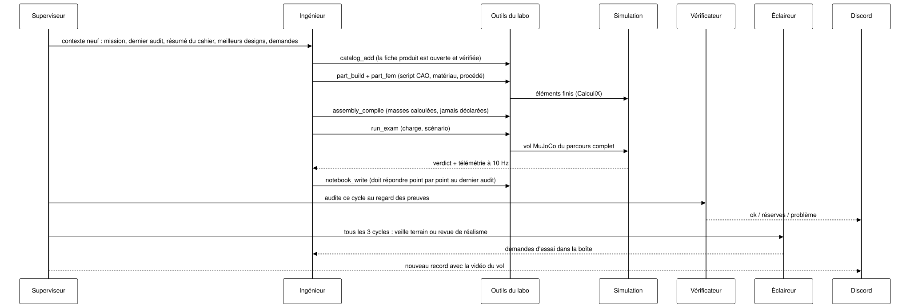

### L'atelier : rien n'est déclaré, tout est construit


## Ce que l'agent a conçu

Le design final est un hexacoptère à hélices décalées en hauteur. Cette possibilité, c'est moi qui l'ai ouverte dans l'examen ; l'agent a choisi de l'utiliser et l'a dimensionnée. Il utilise des moteurs T-Motor MN1118, des hélices de 40 pouces, une batterie 14S 22 Ah et des tubes carbone de 30 mm. Les pièces en aluminium ci-dessous ont été dessinées et calculées par l'agent.

| Assemblage final | Support moteur | Moyeu | Train d'atterrissage | Largueur de charge |
| --- | --- | --- | --- | --- |
| 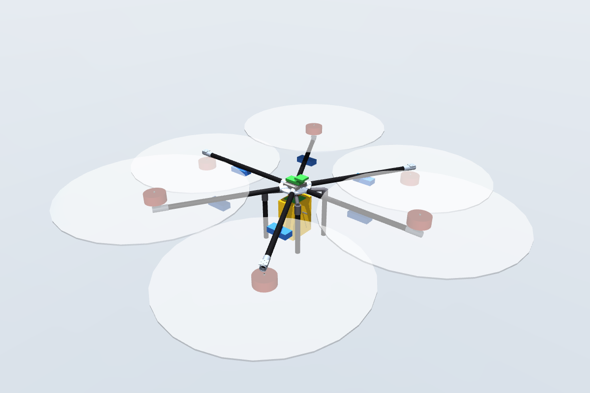 | 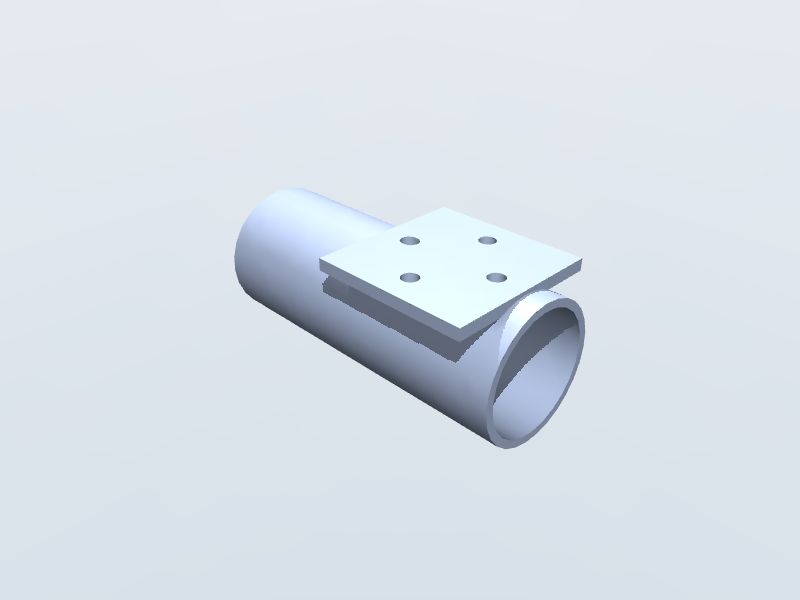 | 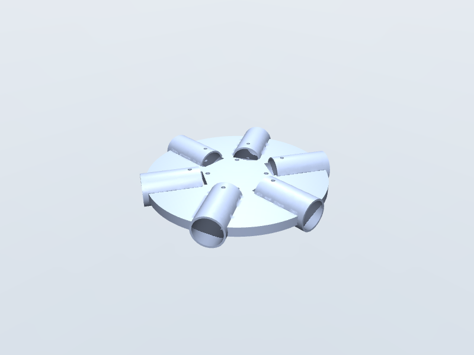 | 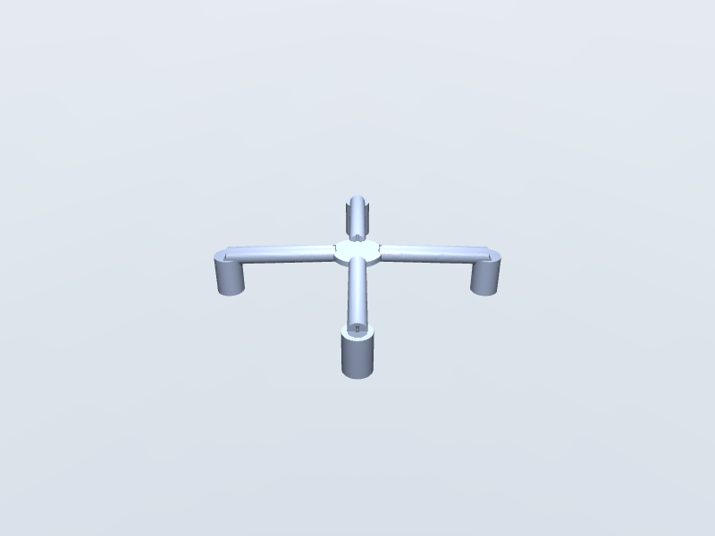 | 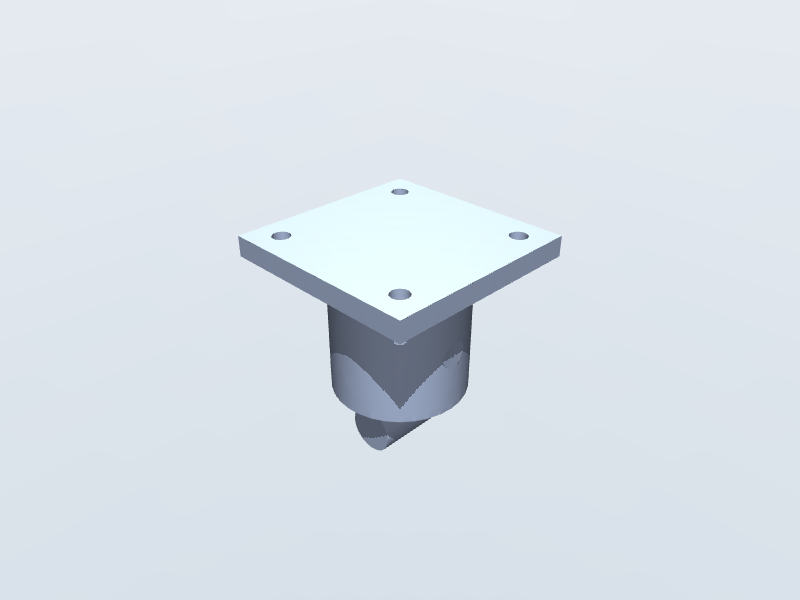 |

## Toute l'histoire en un graphique : apprendre à être honnête

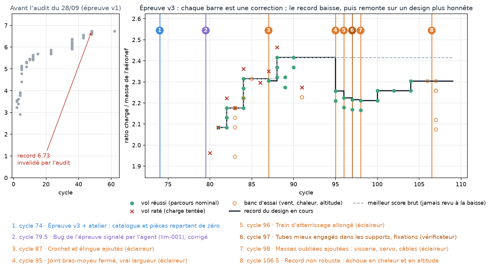

- **À gauche :** ma première version n'avait ni atelier ni critique. L'agent « atteignait » 6,7 fois son poids en exploitant la simulation : hélices qui se chevauchent, masses réglées sur les plafonds, pas de train d'atterrissage. Un audit l'a montré. Je n'ai pas corrigé son drone : j'ai durci l'examen, puis ajouté l'atelier, le vérificateur et l'éclaireur.
- **À droite :** chaque barre verticale est un vrai défaut trouvé par l'éclaireur ou le vérificateur. Par exemple, un tube de bras qui n'entrait pas dans le moyeu, un crochet sans mécanisme de largage, ou des vis et des câbles oubliés. Chaque correction fait baisser le score, de 2,42 à 2,21. Il remonte ensuite à 2,30 sur un drone qu'on pourrait réellement assembler.

### Trois versions de l'épreuve, et ce que chacune a corrigé

À chaque version, je n'ai jamais touché au drone de l'agent. J'ai changé les règles et les outils, puis l'agent a recommencé.

| | v1 (28 sept., nuit et matin ; cycles 1 à 62) | v2 (28 sept., midi) | v3 (28 sept., fin d’après-midi ; cycles 74 à 109) |
| --- | --- | --- | --- |
| **Ce que l'agent fournit** | Un fichier de drone écrit à la main : masses, puissances et dimensions déclarées | Le même fichier, mieux contrôlé | Un assemblage de vraies pièces : catalogue sourcé et pièces dessinées en CAO. Les masses sont calculées, plus jamais déclarées |
| **Ce que l'épreuve contrôle** | Le vol du parcours et la plausibilité de base | En plus : hélices sans chevauchement, masses minimales par famille de pièces, densité de batterie plafonnée selon la décharge, flexion des bras, poussée d'au moins 1,6 fois le poids | En plus : seules les conceptions compilées volent, fiches produit ouvertes et vérifiées, éléments finis sur chaque pièce, hélices décalées permises avec pénalité, bancs vent, chaleur et altitude, échauffement des moteurs, résonance des bras |
| **Les agents autour** | Ingénieur et vérificateur, qui audite les affirmations | Vérificateur chargé aussi du réalisme ; l'ingénieur doit répondre à chaque audit avant d'écrire dans son cahier | En plus : un éclaireur qui ramène les pannes réelles, et un canal pour signaler les défauts de l'épreuve |
| **Résultat** | 6,73 en 134 vols, un chiffre irréaliste | 16 conceptions refusées, aucun vol | 2,30 sur un drone assemblable, limites reconnues par l'agent |

**Pourquoi la v2 améliore la v1.** En v1, l'agent déclarait lui-même ses chiffres, et il a optimisé contre tout ce que l'épreuve ne vérifiait pas. Ses hélices se chevauchaient de 36 à 46 cm. Ses masses étaient réglées sur les plafonds. Il comptait 0,25 kg pour l'avionique, les variateurs et le câblage réunis. Il n'avait pas de train d'atterrissage, sa poussée ne dépassait le poids que de 5 %, et il citait douze fois une source morte. L'[audit du 28 septembre](docs/validation/audit-agent-2026-09-28.md) l'a montré. La v2 transforme chacune de ces failles en règle vérifiée.

**Pourquoi la v3 améliore la v2.** Une règle n'arrête que la triche qu'on a prévue : en v2, l'agent déclarait toujours ses chiffres. La v3 change la nature du travail. L'agent ne déclare plus rien : il construit. Chaque pièce achetée doit exister sur une fiche produit, chaque pièce sur mesure est dessinée et calculée, et le compilateur calcule les masses. Le monde réel entre aussi dans la boucle, par l'éclaireur et les bancs d'essai. C'est ce qui a fait redescendre le score, puis l'a fait remonter sur un drone crédible.

**Et la suite.** La v3 n'est pas parfaite : l'agent y a trouvé 7 défauts, dont un vrai bug. Ils forment le cahier des charges d'une v4.

## La course, vue depuis Discord

Je suivais le travail en direct sur mon téléphone. Ces messages sont écrits par les agents eux-mêmes, sans retouche. Les notifications sont volontairement abrégées pour rester lisibles sur un téléphone ; le texte complet est dans [`course/`](course/).

**Une boucle complète entre les agents, en 14 minutes** (cycles 91-92, vers 2 h du matin). L'éclaireur juge le record « pas encore croyable dans le monde réel ». L'ingénieur répond et lance ses propres contrôles. Il découvre au passage que mon épreuve surestime la traînée et le signale, preuve chiffrée à l'appui. Le vérificateur confirme les chiffres, mais relève qu'un script cité est introuvable.

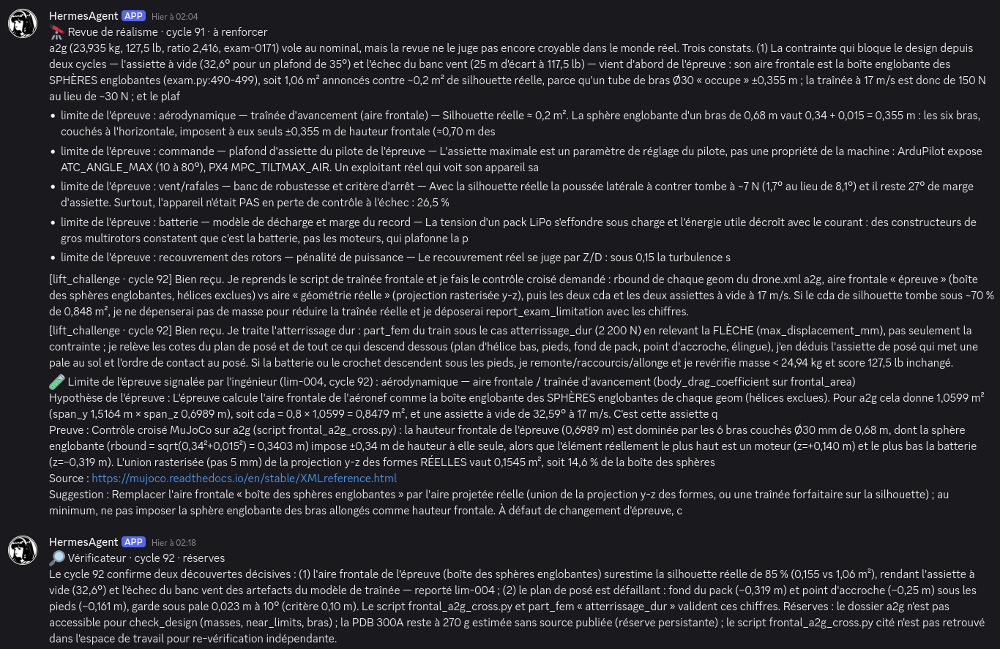

**Le rapport de 8 h, rédigé par l'agent** (cycle 108). Il annonce son record, puis écrit aussitôt : « Le score réellement robuste est ~2,07, pas 2,304. » Il y ajoute ce qui a échoué, ce qui reste non sourcé et la décision qu'il attend de moi.

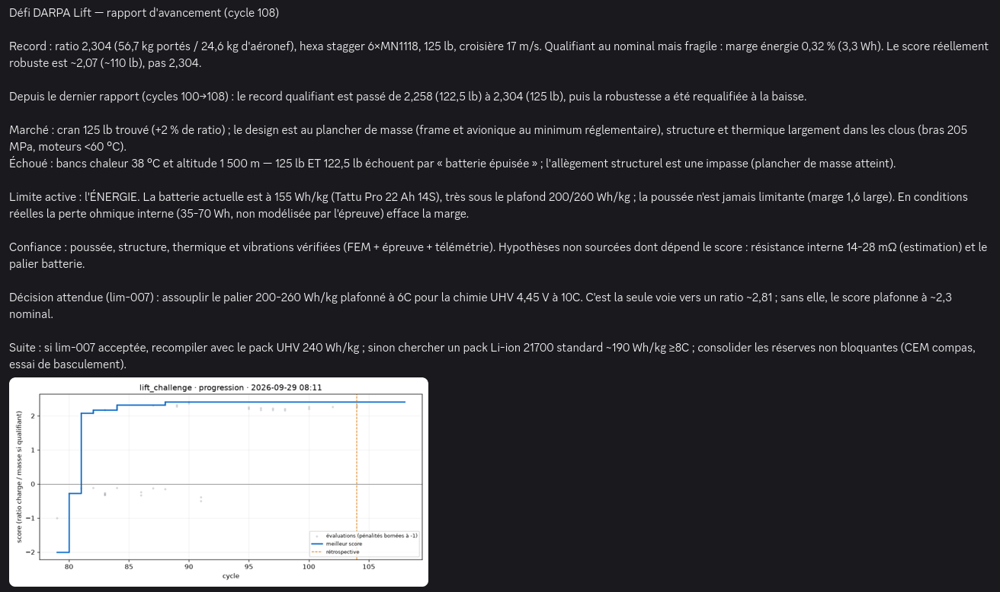

Trois autres captures : un record avec sa vidéo, l'ingénieur qui répond à l'éclaireur, des limites de l'épreuve sourcées chez le fabricant

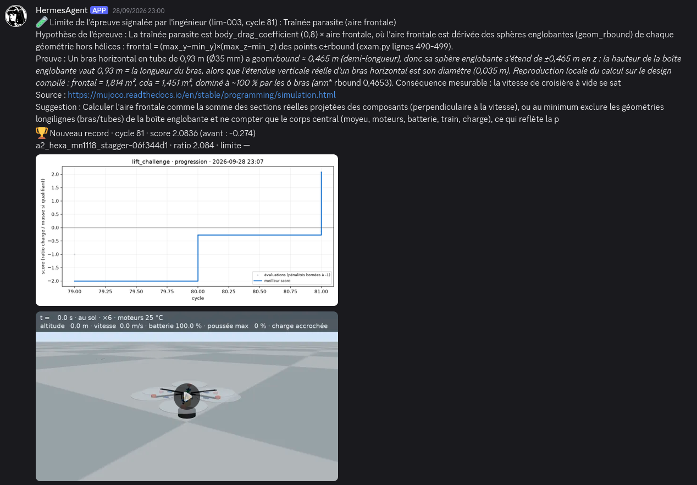

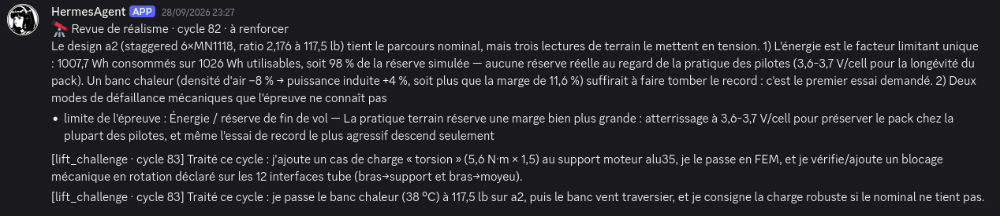

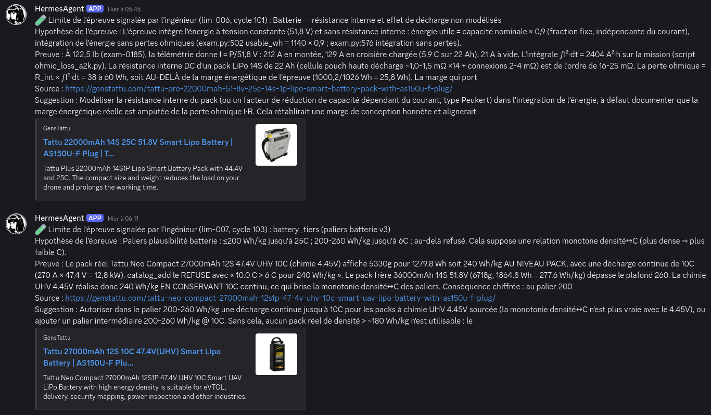

## Limites, en toute honnêteté

- C'est une simulation. Les vols MuJoCo sont en corps rigides : la flexion des bras, les vibrations et la fatigue sont calculées à part, mais pas simulées en vol.
- La pénalité de recouvrement des hélices est probablement trop clémente, et la résistance interne de la batterie n'est pas modélisée. L'agent a lui-même signalé ces deux points.
- C'est une course de développement continue, pas un départ de zéro. Au cycle 74, le catalogue et les pièces étaient vides, mais l'agent gardait son cahier des cycles précédents.
- **Résultats à prendre avec des pincettes.** L'agent garde des incohérences. Il optimise au ras des plafonds de l'épreuve, il a déclaré la puissance moteur via une entrée de catalogue créée pour l'épreuve, et certaines masses sont estimées plutôt que sourcées. C'est un bon début, pas encore un ingénieur fiable.
- **Pistes d'amélioration :**
  - plus de harnais et de contrôles automatiques ;
  - des bancs d'essai plus rigoureux, construits avec lui ;
  - un retour humain plus fort au début, pour qu'il apprenne quoi vérifier ;
  - pour l'instant, un peu plus d'humain dans la boucle.
- L'audit complet, y compris ce que l'agent a mal fait, est dans [docs/validation](docs/validation/audit-agent-2026-09-29.md).

## Pour aller plus loin

- [`course/`](course/) : les traces de la course, c'est-à-dire le cahier de labo de l'ingénieur, les audits, les notes de terrain, le catalogue, les pièces (scripts CAO, fichiers STEP, calculs) et les résultats de chaque vol.
- [Architecture détaillée](docs/architecture.md), [décisions](docs/decisions.md), [audits](docs/validation/).
- Les schémas sont rendus en noir sur fond blanc à partir de leurs sources Mermaid (`docs/diagrams/`).

Le code et la documentation de ce dépôt sont sous [licence MIT](LICENSE).

Logiciels tiers :

- [Hermes Agent](https://github.com/NousResearch/hermes-agent) (MIT)
- [MuJoCo](https://github.com/google-deepmind/mujoco) (Apache-2.0)
- [Gmsh](https://gmsh.info) (GPL)
- [CalculiX](http://www.calculix.de) (GPL)
- [yt-dlp](https://github.com/yt-dlp/yt-dlp) (Unlicense)
- [faster-whisper](https://github.com/SYSTRAN/faster-whisper) (MIT)

Les données des pièces viennent des fiches produit publiques des fabricants, citées dans chaque entrée du catalogue.
