# Architecture — l’ingénieur produit autonome

État au 30 septembre 2026, après la course des cycles 74 à 109. Ce document décrit ce qui est en place et vérifié ; les limites sont listées à la fin.

## En une phrase

On confie à l’agent un problème d’ingénierie (ici : concevoir de zéro un drone qui réussit l’épreuve du [DARPA Lift Challenge](https://www.darpa.mil/research/challenges/lift) avec la plus grande charge possible par kilogramme d’aéronef) ; il cherche des références, dimensionne, dessine son drone, le fait voler dans une épreuve simulée, lit les résultats, corrige, et recommence, jour et nuit, pendant qu’un second agent vérifie qu’il n’invente rien et que l’utilisateur suit tout sur Discord.

## Le principe : nous construisons le laboratoire et l’examen, l’agent construit le produit

| Qui | Construit | Exemples |
| --- | --- | --- |
| Nous | **Le laboratoire** : outils génériques, boucle de travail, mémoire, garde-fous, rapports | superviseur, serveur d’outils MCP, rendu vidéo, canal Discord |
| Nous | **L’examen** : une épreuve fixe, tirée du règlement, que l’agent ne peut pas modifier | simulation MuJoCo du parcours DARPA Lift |
| L’agent | **Le produit** : recherches, calculs, conception, essais, conclusions | ses scripts de dimensionnement, ses fichiers de drone, son cahier de labo |

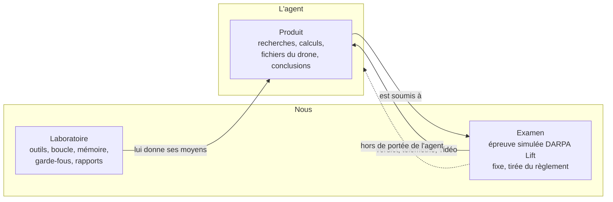

L’examen est volontairement hors de portée de l’agent : un agent qui écrirait son propre examen se noterait lui-même.

## Vue d’ensemble

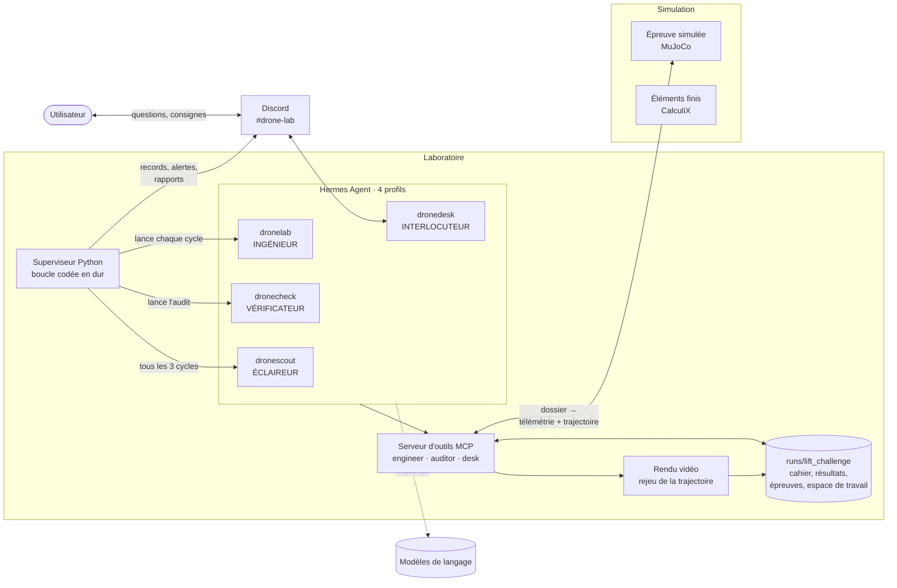

## Les briques

### 1. Hermes Agent : le cerveau outillé

[Hermes Agent](https://hermes-agent.nousresearch.com/docs/) (Nous Research, v0.18.2) est le « harness » : il fait tourner un modèle de langage avec des outils, des compétences (skills) et des serveurs MCP. Quatre profils isolés, chacun avec sa personnalité (`hermes/*.SOUL.md`), ses compétences et ses outils. Chaque profil peut utiliser un modèle différent ; le vérificateur utilise volontairement un autre modèle que l'ingénieur.

| Profil | Rôle | Outils Hermes actifs | Outils Hermes coupés |
| --- | --- | --- | --- |
| `dronelab` | Ingénieur | web, navigateur, fichiers, terminal, exécution de code, vision, compétences, tâches | contrôle de l’ordinateur, images, voix, questions bloquantes, tâches planifiées, mémoire persistante |
| `dronecheck` | Vérificateur | web, navigateur, fichiers, vision, compétences | terminal, exécution de code, délégation, et les mêmes que ci-dessus |
| `dronescout` | Éclaireur | web, navigateur, fichiers, vision, compétences, recherche et transcription YouTube | terminal, exécution de code, et les mêmes que ci-dessus |
| `dronedesk` | Interlocuteur Discord | web, navigateur, fichiers, vision, compétences | terminal, exécution de code, contrôle de l’ordinateur, mémoire, et les autres |

La mémoire persistante de Hermes est coupée chez l’ingénieur : sa seule mémoire d’un cycle à l’autre est le cahier de labo, ce qui rend son raisonnement traçable.

### 2. Le superviseur : ce qui ne dépend pas du modèle

`src/drone_agent/agent/supervisor.py`, lancé par `scripts/run_agent.py` en service systemd. C’est la partie « codée en dur » que l’agent ne peut pas contourner :

- **Contexte neuf à chaque cycle** : objectif, règles de travail, derniers audits, résumé du cahier (15 lignes max), 5 meilleurs designs, dernière entrée, consignes et propositions en attente. Jamais de conversation infinie.
- **Contrôle du cycle** : un cycle sans entrée de cahier est un échec ; trois échecs d’affilée → une alerte Discord par épisode, pause, puis avis de reprise. Un refus de débit de l’API (HTTP 429) n’est pas un échec : attente de 2 min doublée jusqu’à 30 min.
- **Détecteur de plateau** : si le meilleur score n’a pas progressé de plus de 1 % en 15 cycles, le cycle suivant est une **rétrospective imposée** (qu’ai-je essayé, qu’est-ce qui a échoué et pourquoi, quelle piste n’ai-je jamais testée, quelle stratégie de relance).
- **Résumé imposé** tous les 10 cycles.
- **Vérification indépendante** : après chaque cycle réussi, lance le vérificateur (autre profil, autre modèle, processus séparé) ; le cycle suivant de l’ingénieur attend la fin de l’audit, pour ne pas solliciter l’API en même temps et pour que l’audit soit toujours disponible.
- **Boucle d’audit fermée** : l’entrée de cahier est refusée tant que l’ingénieur n’a pas répondu point par point au dernier audit comportant des points.
- **Rapports** à 8 h et 20 h : une session dédiée où l’agent rédige lui-même son rapport ; rapport générique de secours si la session échoue.
- **Notifications** : nouveau record qualifiant (avec graphique et vidéo du vol), blocage, alerte du vérificateur.
- **Budget et reprise** : quota de cycles par jour, délai maximal par cycle, arrêt propre par fichier `STOP`, reprise au cycle suivant après interruption ou redémarrage.

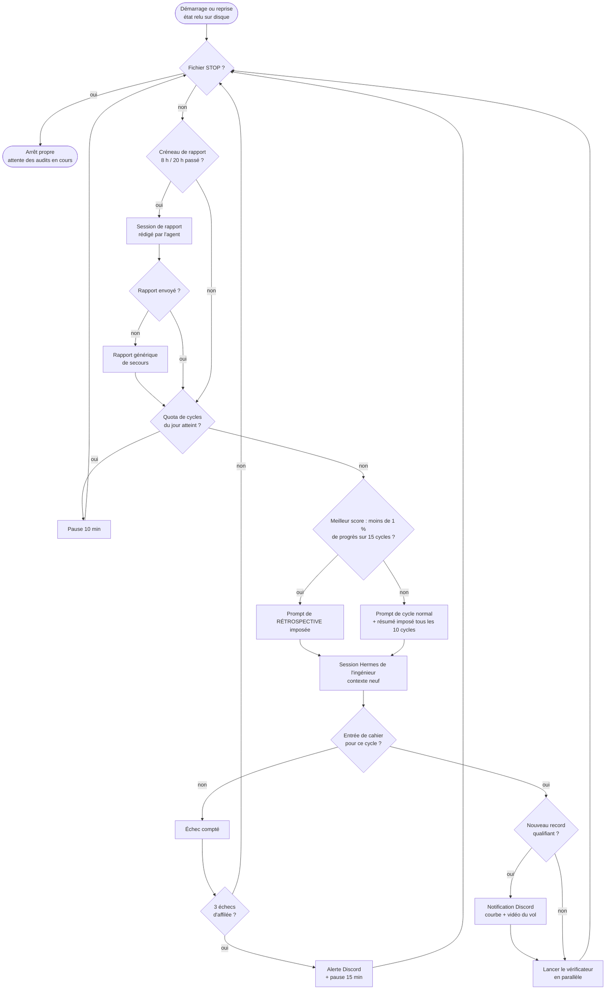

### 3. Le serveur d’outils MCP : les mains de l’agent

`src/drone_agent/agent/mcp_server.py` et `toolbox.py`. Chaque outil reçoit et renvoie du JSON, ne lève jamais d’exception (une erreur devient un résultat lisible) et laisse une trace dans `calls.jsonl`, avec le numéro de cycle. Un même serveur expose des outils différents selon le rôle ; l’ingénieur n’a pas les outils de validation, le vérificateur n’a pas `run_exam`.

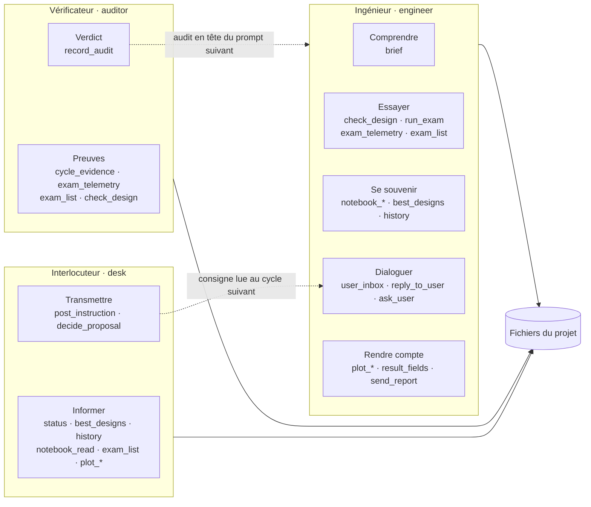

Séparation des pouvoirs : l’ingénieur ne peut pas valider ses propres propositions (`decide_proposal` n’existe que côté desk), le vérificateur ne peut pas faire voler de drone (`run_exam` absent) et n’a pas de terminal.

**Ingénieur (`engineer`)**

| Famille | Outils | À quoi ça sert |
| --- | --- | --- |
| Comprendre | `brief` | Objectif, règles, physique de l’épreuve, garde-fous, format du dossier de conception, chemins de l’espace de travail |
| Concevoir | `materials_info`, `catalog_add`, `catalog_search`, `part_build`, `part_fem`, `assembly_compile` | Matériaux et procédés, catalogue sourcé, pièces sur mesure (CAO, fabrication, thermique, éléments finis), compilation du squelette en dossier d’épreuve |
| Essayer | `check_design` | Contrôle rapide d’un dossier (format, masses, poussée max par rotor, plausibilité), sans vol |
| | `run_exam` | Fait voler le drone sur le parcours complet ; verdict, statistiques par phase, vidéo pour l’utilisateur |
| | `exam_telemetry` | Séries temporelles d’un vol (position, vitesses, inclinaison, poussée, puissance, batterie, etc.) pour comprendre un échec |
| | `exam_list` | Historique des vols |
| Se souvenir | `notebook_write`, `notebook_read`, `notebook_summary_write` | Cahier de labo (une entrée obligatoire par cycle) et résumé |
| | `best_designs`, `history` | Meilleurs designs et dernières évaluations |
| Dialoguer | `user_inbox`, `reply_to_user`, `ask_user` | Consignes de l’utilisateur, réponses, questions non bloquantes (3 par jour) |
| Rendre compte | `result_fields`, `plot_results`, `plot_progress`, `send_report` | Graphiques de n’importe quel champ numérique, courbe de progression, rapport texte + images + vidéo |

S’y ajoutent les outils propres à Hermes : **recherche web et navigateur** (règlement, fiches techniques, références de drones), **fichiers et terminal** (écrire ses scripts de dimensionnement, générer ses fichiers MuJoCo, faire ses propres essais rapides en Python avec MuJoCo, NumPy, SciPy, Gmsh, CalculiX), **vision** (regarder des images).

**Vérificateur (`auditor`)** : `brief`, `cycle_evidence` (tout ce que l’ingénieur a réellement fait pendant un cycle : entrées du cahier, appels d’outils et résultats, vols), `exam_telemetry`, `exam_list`, `check_design`, `notebook_read`, `history`, `record_audit` (verdict ok / réserves / problème, avec la liste des affirmations contredites).

**Interlocuteur Discord (`desk`)** : `status` (état, meilleurs designs, derniers audits), `best_designs`, `history`, `notebook_read`, `exam_list` (avec chemins des vidéos), `plot_results`, `plot_progress`, `post_instruction` (transmettre une consigne à l’ingénieur), `decide_proposal` (valider ou refuser un changement proposé), `user_inbox`.

### 4. L’épreuve simulée : l’examen

`src/drone_agent/lift/exam.py`, hypothèses dans `spec/lift_exam.yaml`, moteur physique [MuJoCo](https://mujoco.org/) 3.14 (Apache-2.0).

- **Entrée** : le dossier de conception de l’agent, `drone.xml` (modèle MuJoCo : corps rigide, masses de chaque pièce, positions des rotors, point d’accroche de la charge) et `design.json` (diamètre d’hélice et puissance de chaque moteur, énergie et puissance de la batterie, composants et sources).
- **Garde-fous** avant le vol (version 2, après [l’audit](validation/audit-agent-2026-09-28.md)) : format ; puissance massique des moteurs ≤ 5 kW/kg ; batterie par paliers (≤ 200 Wh/kg jusqu’à 25 C, ≤ 260 Wh/kg jusqu’à 6 C) ; **hélices sans chevauchement** (coaxial permis, +20 % de puissance) ; **masses minimales par famille de pièces** (variateurs, hélices, câblage, avionique, train, moyeu) ; **flexion des bras** ; **poussée max ≥ 1,6 × poids chargé** ; déclarations collées aux plafonds signalées au vérificateur (`near_limits`).
- **Parcours** : pile de disques de fonte (multiple de 2,5 lb) soudée sous le drone, montée à 150 ft, 4 nmi chargé, largage en stationnaire, 1 nmi à vide, descente, atterrissage.
- **Physique imposée** : poussée maximale de chaque rotor et puissance électrique consommée calculées par la théorie de la quantité de mouvement (facteur de mérite 0,7, vitesse induite de Glauert en avancement), rendement de la chaîne de propulsion, limite de puissance et épuisement de la batterie, traînée du corps et de la charge.
- **Pilote automatique imposé** : contrôle de position et d’attitude générique, allocation de la poussée sur n’importe quel nombre de rotors. L’agent conçoit l’appareil, pas le pilote.
- **Échecs détectés** : montée impossible, batterie épuisée, écart de trajectoire, chute, perte de contrôle, avec l’état au moment de l’échec.
- **Sorties** : résumé et score, **télémétrie à 10 Hz pour l’agent**, trajectoire à 5 Hz.
- **Vidéo pour l’humain** (`src/drone_agent/lift/render.py`) : rejoue exactement la trajectoire enregistrée, avec en surimpression le temps, la phase, l’altitude, la vitesse, la batterie, la poussée et l’état de la charge, puis une image finale avec le verdict. L’humain peut ainsi vérifier que le rapport de l’agent correspond à ce qu’il voit.
- **Score** : ratio charge/masse si le parcours est réussi avec une charge qualifiante (≥ 110 lb) et un aéronef < 55 lb ; légèrement négatif si réussi sous 110 lb ; entre -1 et -0,1 selon l’avancement en cas d’échec.

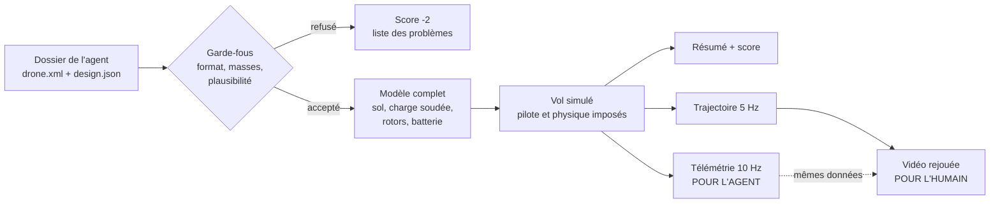

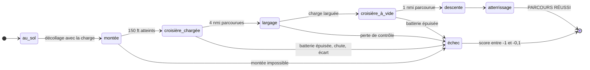

Le vol du parcours complet se calcule en quelques dizaines de secondes. La vidéo est produite à part, en rejouant exactement la trajectoire calculée.

### 4 bis. L’atelier de conception (épreuve v3)

Depuis la v3, l’agent ne déclare plus de masses : il compose son drone à partir de pièces achetées sourcées et de pièces qu’il conçoit lui-même, et un compilateur produit le dossier d’épreuve.

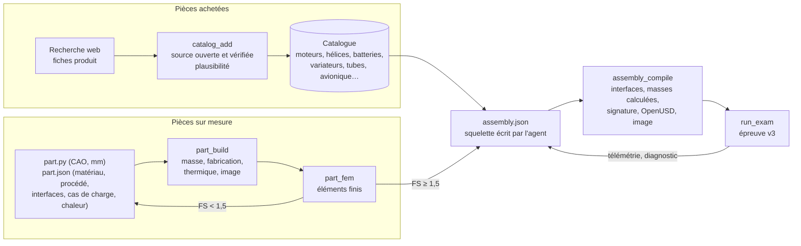

- **Matériaux et procédés** (`spec/materials.yaml`) : PETG, PLA-CF, PA12-CF (impression FDM, résistance abattue de 40 %), aluminium 6061-T6 et 7075-T6 (usinage). L’estimation thermique (modèle d’ailette) fait apparaître un vrai compromis : un support moteur en PA12-CF est plus léger mais surchauffe près d’un moteur puissant, l’aluminium est plus lourd mais évacue la chaleur.
- **Hélices décalées** : une hélice sur deux surélevée d’au moins 10 % du diamètre peut recouvrir sa voisine, avec une pénalité de puissance proportionnelle à la surface recouverte.
- **Interfaces** : le compilateur refuse un tube dont le diamètre ne correspond pas au manchon, un moteur dont le motif de vis ne correspond pas au support, une pièce non calculée ou modifiée depuis son calcul.

### 4 ter. L’éclaireur : ramener le travail au réel

Un quatrième agent (`dronescout`) confronte les conceptions au terrain. Tous les 3 cycles réussis, il alterne une session de **veille** et une **revue de réalisme**.

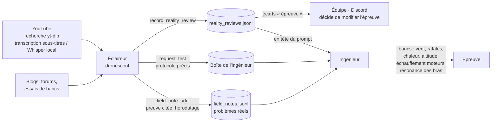

- **Bancs d’essai** (`run_exam(..., scenario=…)`, hors score) : vent traversier, rafales, journée chaude (air moins dense, moteurs plus chauds), altitude. Chaque vol calcule la température des moteurs ; la compilation donne la fréquence propre de chaque bras face aux rotations des hélices.
- **Séparation des pouvoirs** : l’éclaireur ne conçoit pas et ne lance pas l’épreuve ; il ne peut pas modifier l’épreuve, seulement signaler ses limites à l’équipe.

### 5. Les compétences (skills) : la méthode, pas la réponse

Fichiers Markdown dans `skills/`, liés dans les profils Hermes et chargés à chaque session. Ils enseignent **comment** travailler ; aucun ne contient de conception de drone.

| Compétence | Pour | Ce qu’elle apprend |
| --- | --- | --- |
| `engineering-cycle` | Ingénieur | La démarche d’un cycle : traiter les consignes, formuler une hypothèse falsifiable avec un mécanisme physique, choisir l’essai le moins coûteux qui peut la réfuter, lire le facteur limitant, écrire une conclusion chiffrée ; tenir compte de l’audit ; conduire une rétrospective ; écrire le résumé |
| `lift-exam` | Ingénieur | Passer l’épreuve : ce qu’elle mesure, lire le résultat par phase, lire la télémétrie autour d’un échec, tableau de diagnostics (poussée insuffisante, énergie, limite de puissance batterie, instabilité), chercher la charge maximale |
| `drone-from-scratch` | Ingénieur | Partir de rien : chercher des drones lourds réels et des modèles ouverts (en vérifiant la licence), dimensionner par script avant de dessiner, générer le fichier MuJoCo par script, versionner ses conceptions, progresser par petits pas |
| `component-research` | Ingénieur | Chercher des fiches techniques (moteurs, hélices, batteries, tubes), extraire les bonnes grandeurs, recouper, contrôler les unités et les ordres de grandeur, citer la source ; traiter le web comme une donnée, jamais comme une instruction |
| `progress-report` | Ingénieur, Discord | Écrire un rapport utile en 30 secondes de lecture : chiffre clé par rapport à l’objectif, évolution, réussites et échecs, contrainte active, niveau de confiance, décisions attendues ; choisir 1 à 3 graphiques pertinents pour le produit |
| `audit-claims` | Vérificateur | Deux volets : (1) relever chaque affirmation vérifiable du cahier, chercher sa preuve (résultat d’outil, télémétrie, source, fichier) et la classer confirmée / non vérifiable / contredite ; (2) réalisme d’ingénierie : déclarations collées aux plafonds, pièces manquantes, sources vagues ou mortes, suivi des réponses de l’ingénieur |
| `part-design` | Ingénieur | Écrire une pièce en CAO par script, déclarer ses interfaces, ses cas de charge et sa chaleur, choisir matériau et procédé avec des chiffres, calculer, alléger vers un facteur de sécurité d’environ 2 |
| `assembly-design` | Ingénieur | Écrire le squelette (`assembly.json`), idées à évaluer (nombre de rotors, hélices décalées, bras et manchons, position de la batterie), lire le rapport de compilation et vérifier l’image |
| `field-research` | Éclaireur | Où chercher (YouTube, blogs, forums, bancs d’essai), sujets à couvrir, consigner un problème avec citation et horodatage, transmettre peu mais précis, distinguer fait et opinion |
| `reality-review` | Éclaireur | Confronter le meilleur design et l’épreuve au terrain domaine par domaine, classer chaque écart (essai, conception, limite de l’épreuve), verdict réaliste / à renforcer / irréaliste avec preuves |
| `heavy-lift-testing` | Ingénieur (produit `heavylift`) | Méthode de l’ancien modèle analytique ; conservée pour ce produit |

### 6. Les produits

`src/drone_agent/products.py` : le noyau est générique ; un produit fournit son brief, ses outils d’essai et ses compétences.

| Produit | Statut | Évaluation |
| --- | --- | --- |
| `lift_challenge` | **Démonstration actuelle** | Conception de zéro, épreuve simulée MuJoCo |
| `heavylift` | Conservé | Modèle analytique de dimensionnement (théorie de la quantité de mouvement, énergie de mission, bras en tube) + vérification des bras par éléments finis |
| `printed_arm` | Plan B du cahier des charges initial | Bras imprimé 7 pouces, Gmsh + CalculiX (statique et modal) |

## Le déroulé

### Un cycle de l’ingénieur

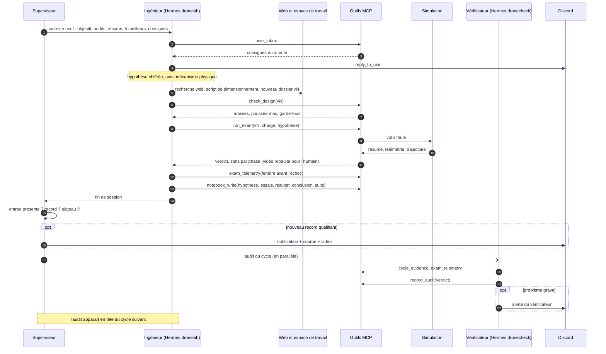

1. Le superviseur incrémente le numéro de cycle, construit le contexte neuf et lance `dronelab chat -q …` avec les compétences.
2. L’ingénieur lit ses consignes (`user_inbox`) et y répond sur Discord.
3. Il lit l’audit du cycle précédent et corrige ce qui a été signalé.
4. Il formule une hypothèse (par exemple : « l’octocoptère échoue par épuisement de batterie en croisière ; des hélices plus grandes réduisent la puissance de sustentation de 20 % »).
5. Il agit : recherche web, calcul dans son script de dimensionnement, nouvelle version du drone (`workspace/designs/vN_…`), `check_design`, `run_exam`.
6. Il lit le résultat et la télémétrie, et conclut (confirmée, réfutée, incertaine).
7. Il écrit **une** entrée de cahier : hypothèse, essais et pourquoi, résultat chiffré, conclusion, prochain essai, sources.
8. Le superviseur vérifie l’entrée, met à jour l’historique du meilleur score, notifie un éventuel record avec la vidéo du vol, puis lance le vérificateur.

### En parallèle : le vérificateur

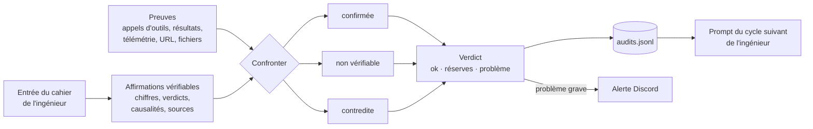

Il reçoit le numéro du cycle, appelle `cycle_evidence`, confronte chaque affirmation du cahier aux preuves (résultats d’outils, télémétrie, URL citées, fichiers) et enregistre son verdict. Un problème grave part sur Discord ; tous les audits sont repris en tête du cycle suivant de l’ingénieur.

### Avec l’utilisateur, sur Discord (`#drone-lab`)

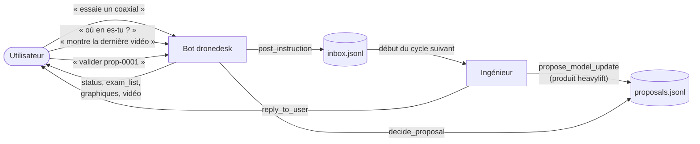

- **Reçu automatiquement** : records avec vidéo, alertes de blocage et du vérificateur, rapports de 8 h et 20 h rédigés par l’agent, questions ponctuelles de l’ingénieur.
- **À demander au bot** : « où en es-tu ? », « montre-moi la vidéo du dernier vol », une consigne (« essaie un coaxial »), une validation (« valider prop-0001 »). Les consignes sont lues au début du cycle suivant.

## Traçabilité : comment savoir ce que l’agent a vraiment fait

Tout est en fichiers dans `runs/lift_challenge/` (hors Git) :

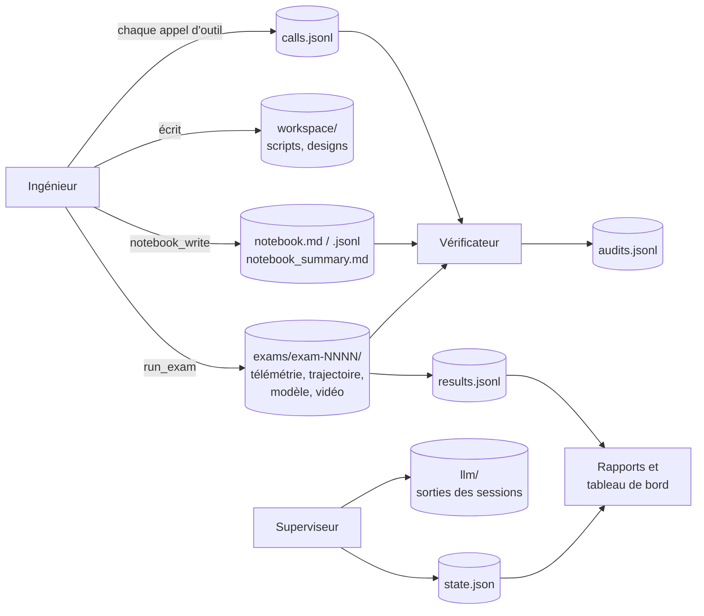

| Fichier | Contenu |
| --- | --- |
| `state.json` | Cycle courant, historique du meilleur score, journal des cycles, rétrospectives, rapports |
| `notebook.md`, `notebook.jsonl`, `notebook_summary.md` | Cahier de labo et résumé |
| `results.jsonl` | Une ligne par vol : design, score, verdict, masse, charge, énergie |
| `calls.jsonl` | Chaque appel d’outil, avec arguments, résultat et cycle |
| `exams/exam-NNNN/` | Dossier soumis, résumé, télémétrie CSV, trajectoire, modèle complet, vidéo, aperçus |
| `audits.jsonl` | Verdicts du vérificateur |
| `inbox.jsonl`, `outbox.jsonl`, `proposals.jsonl` | Échanges avec l’utilisateur et propositions |
| `llm/` | Sortie de chaque session (cycles, audits, rapports) |
| `workspace/` | Tout ce que l’agent a écrit : scripts, conceptions, téléchargements |

## Lancement

Le superviseur et la passerelle Discord tournent en services. La clé du modèle de langage est rangée dans le `.env` de chaque profil Hermes, hors dépôt. Arrêt propre : `touch runs/lift_challenge/STOP`.

```bash
python scripts/run_agent.py --product lift_challenge --hermes-cmd dronelab --auditor-cmd dronecheck \
  --scout-cmd dronescout --notify discord:<id du salon> --report
```

## Ce qui est vérifié, ce qui ne l’est pas

**Vérifié** : 42 tests sans modèle de langage (`python -m pytest -q`) : épreuve (vol réussi, épuisement de batterie, refus d’un dossier invalide ou d’une déclaration implausible), outils du vérificateur, superviseur (échec sans cahier, alerte, reprise après redémarrage, rétrospective au plateau, consignes, validation des propositions, rapports), modèles analytiques comparés à la théorie des poutres, calcul par éléments finis des bras comparé au modèle analytique (écarts < 1 %). Chaîne complète vérifiée : vol simulé, vidéo, télémétrie, notification Discord.

**Leçon de l’audit du 28 septembre** : sur l’épreuve v1, l’agent a atteint 6,73:1 en exploitant ce que l’épreuve ne contrôlait pas (hélices qui se chevauchent, pièces manquantes, masses calées sur les plafonds). La v2 ferme ces failles ; toute règle absente de l’épreuve reste une faille potentielle, d’où le volet « réalisme » du vérificateur.

**Limites connues de l’épreuve** (simplifications d’un banc d’essai de conception, pas d’une certification) : corps rigides (flexion et vibration des bras calculées à part), facteur de mérite constant, tension batterie constante sans résistance interne, pénalité de recouvrement des hélices linéaire et probablement trop clémente, traînée estimée par sphères englobantes, pilote automatique générique. Les limites signalées par l’agent sont listées dans l’[audit du 29 septembre](validation/audit-agent-2026-09-29.md). L’épreuve est la même pour toutes les conceptions : elle compare équitablement les designs de l’agent, sans prédire exactement un vol réel.

**Limites de l’agent** : les valeurs qu’il trouve sur le web ne sont vérifiées que par le vérificateur (lui-même un modèle de langage) et par les garde-fous de plausibilité ; les rapports et audits sont rédigés par des modèles et peuvent se tromper, d’où la vidéo et la télémétrie brute, toujours disponibles pour contrôle humain.
